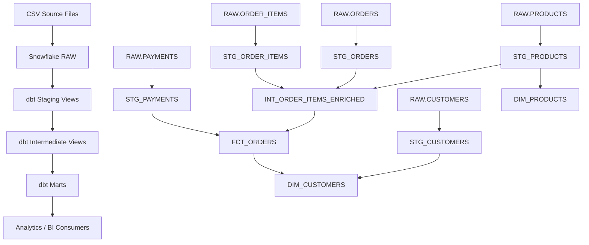
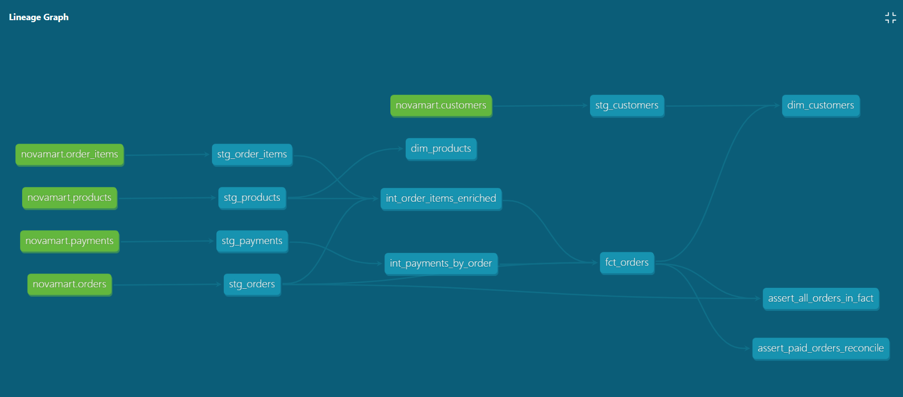
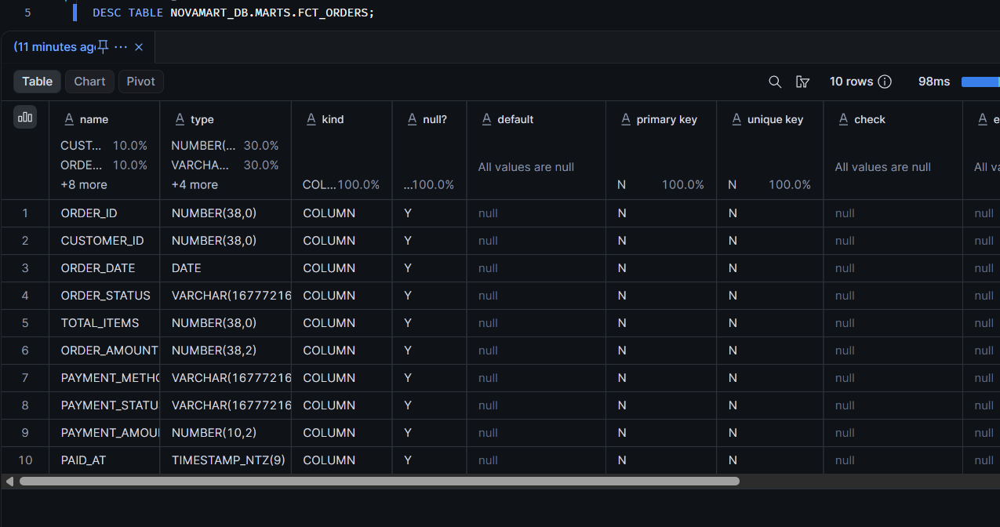
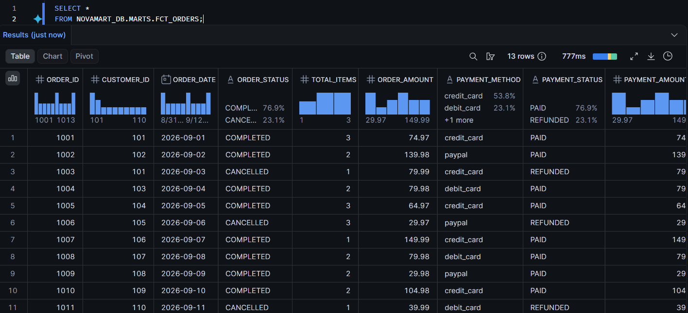
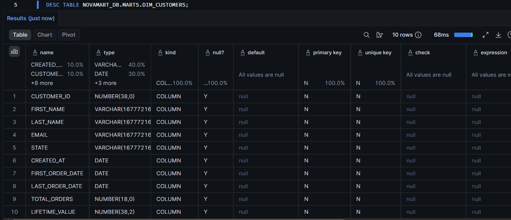
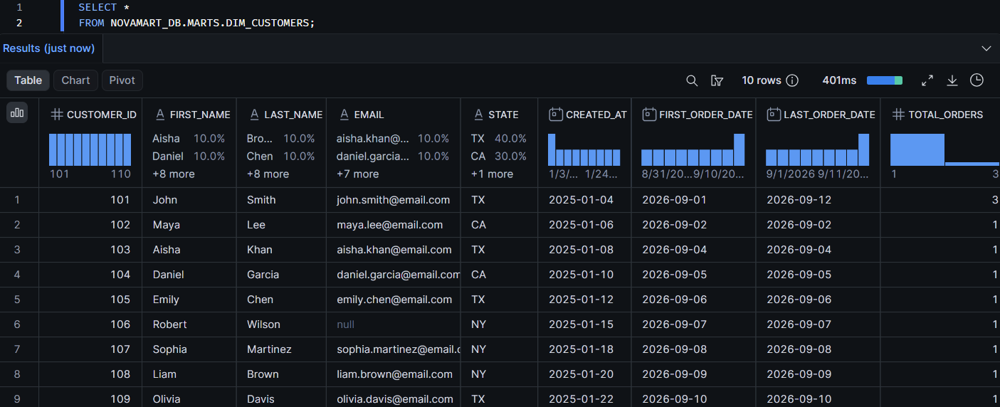
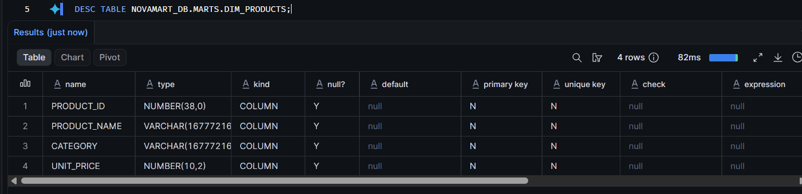
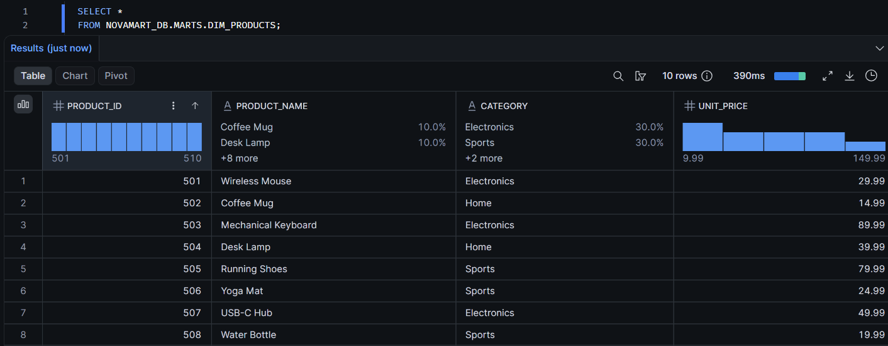

# NovaMart Analytics Engineering Pipeline

An end-to-end analytics engineering project built with **Snowflake + dbt Core**.

The project models raw e-commerce data into trusted analytics-ready datasets using a layered ELT architecture, automated data-quality tests, dimensional modeling, and incremental processing.

## Project goals

NovaMart is a fictional e-commerce company with source data for:

- customers
- products
- orders
- order items
- payments

The goal is to transform raw operational data into reliable datasets that can support questions such as:

- How much revenue was generated?
- Which customers have the highest lifetime value?
- Which products are being purchased?
- How many orders were completed or cancelled?
- What is the average value of an order?

## Tech stack

- **Snowflake** — cloud data warehouse and compute
- **dbt Core** — SQL transformations, testing, documentation, lineage
- **SQL** — transformation and dimensional modeling
- **Git / GitHub** — version control and project documentation

## Architecture



## Layered design

| Layer | Purpose | Materialization |
|---|---|---|
| `RAW` | Preserve source data with minimal transformation | Tables |
| `STAGING` | Clean, standardize, rename, and validate individual source tables | Views |
| `INTERMEDIATE` | Reusable joins and business logic across staging models | Views |
| `MARTS` | Analytics-ready fact and dimension models | Tables / Incremental |

This design is conceptually similar to a medallion architecture:

- `RAW` ≈ Bronze
- `STAGING` + `INTERMEDIATE` ≈ Silver
- `MARTS` ≈ Gold

The mapping is conceptual rather than a strict one-to-one implementation.

## Data model

### Fact table

**`FCT_ORDERS`**

**Grain:** one row per order.

Contains:

- order identifiers
- customer identifiers
- order date and status
- total item count
- order amount
- payment method and status
- payment amount
- payment timestamp

### Dimensions

**`DIM_CUSTOMERS`**

**Grain:** one row per customer.

Includes standardized customer attributes plus:

- first order date
- last order date
- total orders
- lifetime value

**`DIM_PRODUCTS`**

**Grain:** one row per product.

Contains standardized product attributes such as category and unit price.

## dbt model lineage

```text
RAW.CUSTOMERS
    ↓
STG_CUSTOMERS
    ↓
DIM_CUSTOMERS
        ↑
        │
FCT_ORDERS

RAW.PRODUCTS
    ↓
STG_PRODUCTS ───────────────→ DIM_PRODUCTS
    ↓
INT_ORDER_ITEMS_ENRICHED
        ↑
STG_ORDERS
        ↑
RAW.ORDERS

STG_ORDER_ITEMS
        ↑
RAW.ORDER_ITEMS

INT_ORDER_ITEMS_ENRICHED
        ↓
FCT_ORDERS
        ↑
STG_PAYMENTS
        ↑
RAW.PAYMENTS
```

## Data quality

The project uses dbt data tests to validate assumptions such as:

- primary identifiers are not null
- primary identifiers are unique
- order customer IDs exist in the customer model
- order item order IDs exist in the order model
- order item product IDs exist in the product model
- payment order IDs exist in the order model
- order status values are restricted to expected values
- payment status values are restricted to expected values

Examples include:

```yaml
data_tests:
  - not_null
  - unique
```

and:

```yaml
data_tests:
  - relationships:
      arguments:
        to: ref('stg_customers')
        field: customer_id
```

## Incremental processing

`FCT_ORDERS` is implemented as an incremental dbt model.

Conceptually:

```text
existing FCT_ORDERS
        +
new qualifying source orders
        ↓
incremental dbt run
        ↓
updated FCT_ORDERS
```

The project uses an order-level unique key and an incremental filter so the entire fact table does not need to be rebuilt on every run.

For this demo, the incremental filter is based on `order_date`.

## Project Screenshots

### dbt Lineage

The dbt DAG shows the dependency flow from Snowflake source tables through staging and intermediate models into analytics-ready marts.



### Fact Table Structure

`FCT_ORDERS` is materialized in Snowflake with one row per order.



### Fact Table Sample Data

Sample rows from the final fact table.



### Customer Dimension





### Product Dimension





### Production consideration

A production pipeline would usually use a more robust change-detection strategy such as:

- `updated_at`
- CDC
- watermarks
- lookback windows
- merge/upsert logic

This would help capture late-arriving records and updates to historical orders.

## dbt concepts demonstrated

This project demonstrates:

- `source()`
- `ref()`
- model dependencies
- DAG / lineage
- staging models
- intermediate models
- marts
- views
- tables
- incremental models
- schema routing
- custom macros
- dbt generic tests
- dimensional modeling
- referential integrity
- ELT architecture

## Repository structure

```text
novamart/
│
├── dbt_project.yml
│
├── models/
│   ├── staging/
│   │   ├── _sources.yml
│   │   ├── schema.yml
│   │   ├── stg_customers.sql
│   │   ├── stg_products.sql
│   │   ├── stg_orders.sql
│   │   ├── stg_order_items.sql
│   │   └── stg_payments.sql
│   │
│   ├── intermediate/
│   │   └── int_order_items_enriched.sql
│   │
│   └── marts/
│       ├── schema.yml
│       ├── fct_orders.sql
│       ├── dim_customers.sql
│       └── dim_products.sql
│
├── macros/
│   └── generate_schema_name.sql
├── docs/
│   ├──  DBT_Data_Lineage_Graph.png
│   ├── fct_orders_structure.png
│   ├── fct_orders_sample_data.png
│   ├── dim_customers_structure.png
│   ├── dim_customers_data.png
│   ├──  dim_products_structure.png
│   ├── dim_products_data.png
│
├── profiles.yml.example
├── requirements.txt
├── .gitignore
└── README.md
```

## Local setup

### 1. Create and activate a Python virtual environment

Windows:

```bash
python -m venv .venv
.venv\Scripts\activate.bat
```

### 2. Install dependencies

```bash
pip install -r requirements.txt
```

### 3. Configure the dbt profile

Copy the example profile:

```text
profiles.yml.example
```

to your local dbt profiles directory:

```text
C:\Users\<your-user>\.dbt\profiles.yml
```

Do not commit secrets to GitHub.

The example profile expects a Snowflake token through an environment variable:

```text
SNOWFLAKE_PAT
```

### 4. Validate the connection

```bash
dbt debug
```

### 5. Build the project

```bash
dbt build
```

### 6. Run only the marts

```bash
dbt build --select path:models/marts
```

## Example commands

Build a single model:

```bash
dbt run --select stg_customers
```

Run staging models:

```bash
dbt run --select path:models/staging
```

Run tests:

```bash
dbt test
```

Run the incremental fact:

```bash
dbt run --select fct_orders
```

Force a full rebuild of the incremental model:

```bash
dbt run --select fct_orders --full-refresh
```

## Key design decisions

**Why views for staging?**  
Staging transformations are lightweight, and views automatically reflect changes in the raw source tables without requiring a physical rebuild.

**Why an intermediate layer?**  
It keeps reusable joins and transformation logic out of final marts and prevents repeated SQL across downstream models.

**Why a fact/dimension mart?**  
It gives analytics consumers a clear business-oriented model with explicitly defined grain.

**Why incremental processing?**  
It avoids rebuilding the entire fact table when only a small amount of new data arrives.

## What I learned

This project reinforced practical understanding of:

- the difference between ETL and ELT
- how Snowflake separates storage and compute
- how dbt manages transformations inside a warehouse
- how `source()` differs from `ref()`
- why grain matters in fact-table design
- how referential integrity can be tested in dbt
- why staging models are often materialized as views
- how incremental models reduce unnecessary recomputation
- how layered data architecture maps to Bronze / Silver / Gold concepts

## Future improvements

Possible extensions:

- add CI with GitHub Actions
- add source freshness checks
- add audit columns such as `loaded_at`
- use `updated_at` for production-style incremental logic
- add snapshots for slowly changing dimensions
- add a BI dashboard
- add orchestration with Airflow
- add ingestion using Fivetran or Airbyte
- introduce role-based access control instead of using an administrative role

---

Built as a portfolio project to demonstrate practical analytics engineering and modern cloud data transformation patterns.
